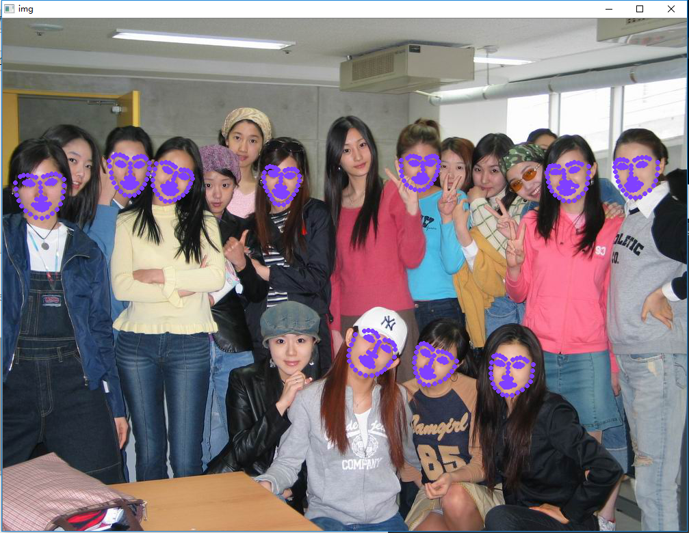

## this demo is used for detect human face

### require

* dlib [dlib主页](http://dlib.net/)

### result

here is detect result :

Clearly, if we use dlib face to detect face, a lot of face will be ignore
